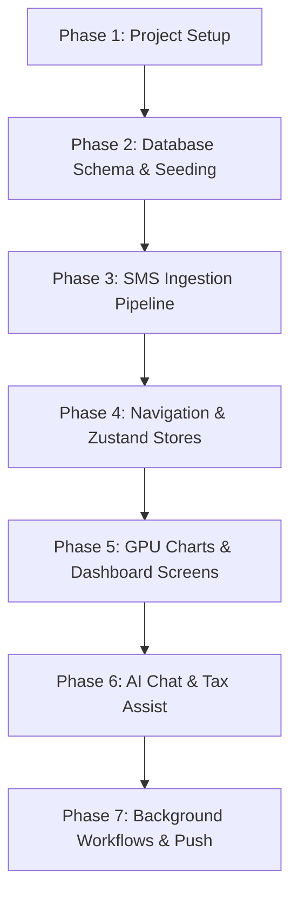

# Regent Money - Agent Build & Developer Roadmap

This document serves as the implementation blueprint and prompt sequence for developer agents to complete the feature-set of Regent Money.

---

## 1. Premium Visual Design System

All screens must strictly adhere to the following design token set:

| Token | HSL / Hex Value | Description / Use Case |
| :--- | :--- | :--- |
| **Deep Space Bg** | `#0A0A0F` | Main application background (absolute dark) |
| **Card Surface** | `#12121A` | Content blocks, panels, list items |
| **Border / Stroke** | `#1E1E2C` | Subtle dividers and outline styling |
| **Glass Overlay** | `rgba(18, 18, 26, 0.7)` | Floating sheets, modal backdrops (with blur) |
| **Primary Cyan** | `#03DAC6` | Highlights, active navigation, positive indicators |
| **Accent Purple** | `#BB86FC` | Goals progress, compound interest charts |
| **Alert Red** | `#FF7B7B` | Budget overrun, debit indicators, anomalies |
| **Success Green** | `#7BFF9F` | Salary credit, savings targets achieved |
| **Text Muted** | `#8E8E9F` | Subtitles, helper text, details labels |

---

## 2. Technical Roadmap & Execution Phases



### Phase 1: Core Setup (Completed)
- Initialize Expo bare project.
- Configure TS compiler options for WatermelonDB legacy decorators.
- Define Android native permission bindings in `app.json`.

### Phase 2: Offline DB Structure (Completed)
- Deploy WatermelonDB Schema with indices on transaction category & date.
- Establish models classes for all 18 tables.
- Deploy local MMKV settings.

### Phase 3: Core Service Layer (Completed)
- Deploy HDFC/SBI/Axis/UPI regex SMS parser.
- Deploy sanitizer and anonymizer middleware.
- Deploy Gemini 1.5 Flash & Groq Llama 3 API connectors.
- Deploy Mock Data Injector.

---

## 3. Step-by-Step Agent Prompt Playbook
*Feed these prompts to your developer agent in order to implement the core screens.*

### Prompt 1: Dashboard Screen & Victory Skia Charts
```markdown
Context: React Native (Expo bare) app with WatermelonDB database containing Transactions.
Task: Write a premium, high-performance Dashboard screen using:
1. '@shopify/react-native-skia' and 'victory-native' (Victory Native XL) to render two GPU-accelerated charts:
   - An Area Chart showing Net Worth growth over the past 6 months (NetWorthSnapshot model). Use a gradient fill (from Primary Cyan to transparent).
   - A Donut chart showing spending breakdown by category for the current month.
2. A ScrollView showcasing:
   - Total Net Worth card with neon gradient borders.
   - Income vs Expense balance card.
   - A list of recent 5 transactions (from the transactions table) with clear merchant names, categories, amounts, and credit/debit indicators.
3. Add a filter row to filter transactions by category (food, transport, shopping, etc.) updating the charts smoothly.
Theme: Deep Space Bg (#0A0A0F), Card Surface (#12121A), border (#1E1E2C). Make it feel premium, high-contrast, with Outfitters font family if possible.
```

### Prompt 2: AI Chatbot Screen with Groq and Context Sharing
```markdown
Context: Groq Llama 3 API client is ready in `src/services/aiService.ts`.
Task: Build the Chat screen where the user chats with "Regent Money AI".
1. Implement a flat list of messages styled as chat bubbles. User messages: Deep Space Bg with subtle cyan borders. AI messages: Card Surface with white text.
2. Create the chat input bar containing a mic icon (bind react-native-voice to it) and a send button.
3. When sending a message:
   - Retrieve the current active budgets (BudgetDeclaration model) and the last 10 transactions.
   - Anonymize them using the sanitizer.ts service.
   - Pass the message, chat history, and the sanitized context to `askChatbot` from `aiService.ts`.
   - Display a clean typing loading indicator (Reanimated bounce dot sequence) while waiting.
4. Auto-scroll to the bottom of the list when new messages arrive.
```

### Prompt 3: Goals Screen & Compound Interest Simulator
```markdown
Context: SavingsGoal and GoalContribution tables.
Task: Build the Savings Goals screen.
1. Render a list of active savings goals. Each goal must show name, current amount, target amount, and target date, with a smooth progress bar.
2. Underneath, build a "What-If Compound Interest Simulator":
   - Add three horizontal sliders (monthly contribution amount, expected annual return rate 1-30%, years duration 1-40).
   - Use D3 math calculations to plot the curve points dynamically.
   - Render the curve using Victory Native XL line chart.
   - Use React Native Reanimated to animate the line chart curve smoothly as the sliders drag.
   - Display the total projected wealth, total amount invested, and wealth gained through compounding in neon colors.
```

### Prompt 4: OCR SmartScan & Camera Import
```markdown
Context: expo-camera, expo-image-picker, and @react-native-ml-kit/text-recognition.
Task: Build the smart receipt scanning camera screen.
1. Use `expo-camera` to show a live camera view with a rectangular scanning frame overlay.
2. Provide a floating button to capture the picture or pick from the gallery using `expo-image-picker`.
3. After capturing/selecting:
   - Run the image through `@react-native-ml-kit/text-recognition` to extract all text lines.
   - Run a custom parser to locate: Transaction amount (look for numbers near "Total", "Paid", "Rs.", "INR"), Merchant (first non-generic line), and Date.
   - Open a premium bottom sheet modal (Gorhom Bottom Sheet) prefilled with the parsed transaction details.
   - Allow the user to edit and tap "Confirm" to save to WatermelonDB.
```

### Prompt 5: Background Task Register & System Receivers
```markdown
Context: expo-background-fetch, expo-task-manager, react-native-get-sms-android.
Task: Set up the background SMS scan listener.
1. Create a background task registered with `expo-task-manager` named `BACKGROUND_SMS_SCAN`.
2. Configure `expo-background-fetch` to run the task every 15 minutes.
3. In the task handler:
   - Fetch new SMS messages received since the last scan timestamp (stored in MMKV).
   - Parse each SMS message body using `parseSMS` from `smsParser.ts`.
   - If a transaction is successfully parsed, create a record in WatermelonDB.
   - Send a local push notification using `expo-notifications` showing the amount and category, with a quick action button "Flag Anomaly" or "Categorize".
4. Register a boot receiver so this task restarts when the device reboot completes (`RECEIVE_BOOT_COMPLETED` permission).
```

---

## 4. Verification Checklists for Agents

When verifying code changes, agents must check:
- [ ] No compilation errors when running `tsc --noEmit`.
- [ ] Any text manipulation of transaction details passes through `sanitizeTransactions` first.
- [ ] All database writes occur inside `database.write(...)` transactions.
- [ ] All decimal calculations use float parsing and rounding (`.toFixed(2)`) to avoid floats precision bugs.
